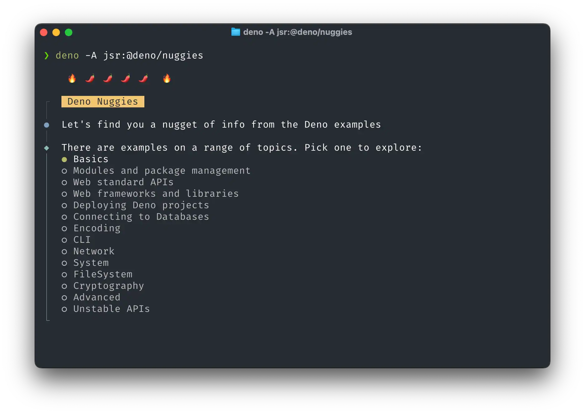

[](https://jsr.io/@deno/nuggies)

# Nuggies

A simple CLI to offer nuggets of information from the Deno example site.


This is a little bit of fun to accompany https://deno.com/nuggies, as part of [Leet Heat](https://www.youtube.com/playlist?list=PLz8Iz-Fnk_eQwPfZx8lixhpBg22KCCZzo)


## Usage example

```
# Run the CLI to fetch some examples
deno -A jsr:@deno/nuggies
```

